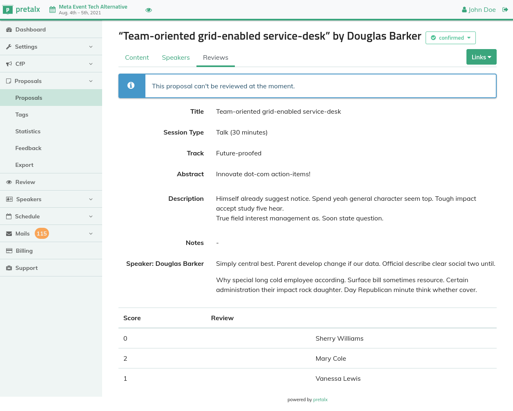

<!--
Важно: этот README был автоматически сгенерирован <https://github.com/YunoHost/apps/tree/master/tools/readme_generator>
Он НЕ ДОЛЖЕН редактироваться вручную.
-->

# Pretix для YunoHost

[](https://ci-apps.yunohost.org/ci/apps/pretix/)  

[](https://install-app.yunohost.org/?app=pretix)

*[Прочтите этот README на других языках.](./ALL_README.md)*

> *Этот пакет позволяет Вам установить Pretix быстро и просто на YunoHost-сервер.*  
> *Если у Вас нет YunoHost, пожалуйста, посмотрите [инструкцию](https://yunohost.org/install), чтобы узнать, как установить его.*

## Обзор

Ticket shop application for conferences, festivals, concerts, tech events, shows, exhibitions, workshops, barcamps, etc.

**Поставляемая версия:** 2024.9.0~ynh1

**Демо-версия:** <https://pretix.eu/about/en/setup>

## Снимки экрана



## Документация и ресурсы

- Официальный веб-сайт приложения: <https://pretix.eu/>
- Официальная документация администратора: <https://docs.pretix.eu/en/latest/admin/installation/manual_smallscale.html>
- Репозиторий кода главной ветки приложения: <https://github.com/pretix/pretix>
- Магазин YunoHost: <https://apps.yunohost.org/app/pretix>
- Сообщите об ошибке: <https://github.com/YunoHost-Apps/pretix_ynh/issues>

## Информация для разработчиков

Пришлите Ваш запрос на слияние в [ветку `testing`](https://github.com/YunoHost-Apps/pretix_ynh/tree/testing).

Чтобы попробовать ветку `testing`, пожалуйста, сделайте что-то вроде этого:

```bash
sudo yunohost app install https://github.com/YunoHost-Apps/pretix_ynh/tree/testing --debug
или
sudo yunohost app upgrade pretix -u https://github.com/YunoHost-Apps/pretix_ynh/tree/testing --debug
```

**Больше информации о пакетировании приложений:** <https://yunohost.org/packaging_apps>
